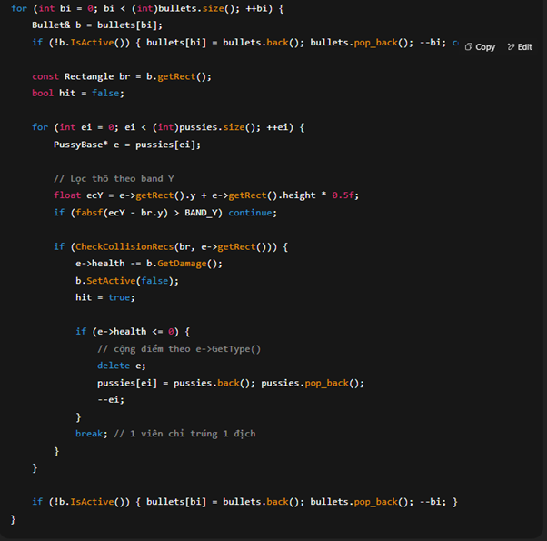
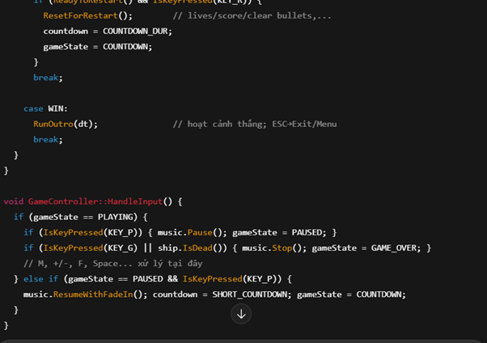
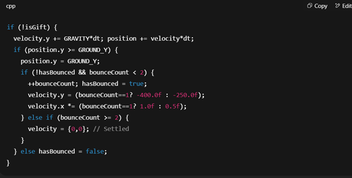

**AI COLLABORATION LOG (AI\_LOG.md)**

**Dự án:** PUSSY\_INVADERS

Quy trình Phát triển dựa trên AI

**I QUÁ TRÌNH SỬ DỤNG AI**

**Giai đoạn 1: Lên ý tưởng & Thiết kế Kiến trúc**

**Interactions (Thiết kế lớp & kiến trúc)**

**Câu 1**

**Prompt:** "Thiết kế sơ bộ các lớp cho game bắn súng ngang 2D gồm: SpaceShip, Bullet, Enemy (đa tầng), Pickup, Background, MusicController, GameController. Vẽ mô tả mối quan hệ giữa các lớp."  
**AI Output:**

**1) Thiết kế sơ bộ lớp & mô tả quan hệ (SpaceShip, Bullet, Enemy đa tầng, Pickup, Background, MusicController, GameController)**

**A. Mục tiêu & nguyên tắc kiến trúc**

*   **Mục tiêu**: tách rõ **logic gameplay** (tàu, đạn, địch, vật phẩm) khỏi **điều phối** (vòng lặp, input, state game) và **dịch vụ** (nhạc, nền).
*   **Nguyên tắc**:
    1.  **Single responsibility**: mỗi lớp làm đúng một việc chính.
    2.  **Composition over inheritance**: chỉ kế thừa khi thật cần (Enemy đa tầng); còn lại dùng sở hữu/hợp tác (GameController sở hữu danh sách).
    3.  **Dữ liệu gọn nhẹ**: Bullet nhẹ (pos, speed, damage, active, texture\*), AABB cho va chạm.
    4.  **Tài nguyên tĩnh** cho sprite kẻ địch (texture static trong từng lớp con) → load/unload một lần.

**B. Danh sách lớp & trách nhiệm (định nghĩa mức “contract” + API cốt lõi)**

**1) GameController**

*   **Vai trò**: “nhạc trưởng” — điều phối **state** (WAVE\_INTRO/COUNTDOWN/PLAYING/PAUSED/GAME\_OVER/OUTRO), input, vòng đời **SpaceShip**, **Bullets**, **Enemies**, **Pickups**, **Music**, **Background**.
*   **Sở hữu**:
    *   SpaceShip ship;
    *   std::vector<Bullet> bullets; (đạn người chơi — kiểu giá trị)
    *   std::vector<Bullet\*> pussyBullets; (đạn địch — con trỏ, có delete)
    *   std::vector<PussyBase\*> pussies; (địch — con trỏ, có delete)
    *   Background background;, MusicController music;
    *   Texture/Sound dùng chung (bullet\_texture, thunder\_texture, …)
*   **API chính**:
    *   void Update(); void Draw();
    *   void HandleInput(); void HandleCountdown();
    *   void DrawWaveIntro(); void DrawPaused(); void DrawGameOver();
    *   void HandlePussyWaveProgression(); (sang Pussy2/Pussy3)
*   **Quy tắc sở hữu**: chịu trách nhiệm **delete** pussies & pussyBullets khi remove/thoát.

**2) SpaceShip**

*   **Vai trò**: thực thể người chơi (di chuyển, bắn, ăn vật phẩm, hiển thị HUD).
*   **Dữ liệu chính**: position, ship\_scale, hiệu ứng **recoil** (offset/timer/strength), trạng thái **no\_shooting**, **lives/score**…
*   **API chính**:
    *   void Moving(); void MovingWhileBlinking(Color tint);
    *   void Shooting(std::vector<Bullet>& bullets, Texture2D\* bulletTex);
    *   Rectangle getRect() const;
    *   int HitBoxChecking(std::vector<Bullet\*>& enemyBullets);
    *   void EatPickup(); void StatusBar();
    *   void AdjustStatus(enum Effect); void SetAttribute();
*   **Tương tác**: sinh **Bullet** (push vào GameController::bullets), kiểm tra nhặt Pickup, trừ mạng khi trúng đạn/meteor.

**3) Bullet**

*   **Vai trò**: đạn (cả hai phe dùng cùng lớp; đạn địch đảo chiều tốc độ Y).
*   **Dữ liệu**: Vector2 position; float speed; int damage; bool active; Texture2D\* texture;
*   **API chính**:
    *   void Update(); void Draw();
    *   Rectangle getRect() const;
    *   bool IsActive() const; void SetActive(bool);
    *   int GetDamage() const;
*   **Thiết kế nhẹ**: **không** sở hữu texture (chỉ giữ **con trỏ**).

**4) Enemy đa tầng: PussyBase (base) và Pussy, Pussy2, Pussy3 (derived)**

*   **Vai trò**: đàn địch kiểu Space-Invaders, di chuyển đồng bộ theo **pussyDirection**; bắn định kỳ theo **pussyShootTimer**.
*   **Base (PussyBase)**:
    *   **Dữ liệu**: Vector2 position; int health;
    *   **Static dùng chung đàn**:  
        static float pussyDirection;  
        static float pussyShootTimer;  
        static float pussyShootInterval;
    *   **API ảo**:
        *   virtual void Draw() = 0;
        *   virtual void Update(float direction);
        *   virtual int GetType() const = 0;
        *   virtual Texture2D& getTexture() = 0;
        *   Rectangle getRect() const;
*   **Derived (Pussy, Pussy2, Pussy3)**:
    *   Mỗi lớp có static Texture2D image; + LoadImage()/UnloadImage();
    *   GetType() khác nhau; có thể cấu hình **health**/pattern bắn khác.

**5) Pickup**

*   **Vai trò**: vật phẩm rơi (Sushi/Milk/Battery) **nảy 2 lần** rồi nằm yên; **Gift** rơi thẳng đến đáy mới biến mất; có **glow** quay.
*   **Quản lý tĩnh**:  
    static std::vector<Pickup> pickups;  
    static bool isLoaded; static float giftTimer;  
    Texture tĩnh cho sushi/milk/battery/gift/glow.
*   **Dữ liệu**: Vector2 position; Vector2 velocity; int bounceCount; bool hasBounced; bool isGift; float rotationAngle; float lifeTime;
*   **API**:
    *   static void LoadTextures(); static void UpdateAll(float dt); static void DrawAll();
    *   static void Spawn(Vector2 pos); static void SpawnGift();
    *   void Update(float dt); void Draw() const;
    *   Rectangle GetRect() const; (nếu cần va chạm pickup-ship)

**6) Background**

*   **Vai trò**: nền quay/scale theo cửa sổ, tạo cảm giác chuyển động.
*   **Dữ liệu**: Texture2D texture; Vector2 center; float scale; float rotation; float speed;
*   **API**:
    *   void DrawRotatingBackground() const;
    *   void SetCenter(float x, float y); void CalculateBackgroundScale();
    *   Getter/Setter rotation/speed.

**7) MusicController**

*   **Vai trò**: nhạc nền với **fade in/out**, **pause/resume**, **master volume**.
*   **State**: MUSIC\_IDLE, MUSIC\_FADING\_IN, MUSIC\_PLAYING, MUSIC\_FADING\_OUT, MUSIC\_PAUSED
*   **Dữ liệu**: Music backgroundMusic; bool musicLoaded; float masterVolume; float currentVolume; float fadeDuration; float pausedVolume;
*   **API**:
    *   void LoadBackgroundMusic();
    *   void HandleMusic(GameState gameState);
    *   Getter/Setter: SetState/GetState, SetMVolume/GetMVolume, SetCVolume/GetCVolume, SetDuration/GetDuration, SetPVolume/GetPVolume, SetVolumeNow(float).

**C. Quan hệ giữa các lớp (ownership, dùng chung, kế thừa)**

*   **GameController** **sở hữu**: ship/background/music/bullets/pussyBullets/pussies, và **điều phối** mọi thứ.
*   **SpaceShip** **tạo** Bullet (add vào GameController::bullets), **ăn** Pickup, **va chạm** với đạn địch/metor.
*   **PussyBase** là **base**, Pussy/Pussy2/Pussy3 **kế thừa** và dùng **texture static** riêng.
*   **Pickup** giữ **danh sách tĩnh** (lớp tự quản lý vòng đời object của chính nó); GameController chỉ gọi UpdateAll/DrawAll.
*   **MusicController** được GameController **gọi mỗi frame** để đồng bộ với GameState.
*   **Background** do GameController cập nhật/wrapper khi resize, countdown, game over (slow-motion).

*   


**E. Chu trình 1 frame (luồng xử lý chuẩn)**

1.  **Input**: GameController::HandleInput() (SPACE bắn, M/± nhạc, P pause, G gameover giả lập, F fullscreen).
2.  **State**: GameController::Update() phân nhánh theo GameState (WAVE\_INTRO/COUNTDOWN/PLAYING/PAUSED/GAME\_OVER/OUTRO).
3.  **Music**: music.HandleMusic(gameState) (fade/pause/resume).
4.  **Ship**: ship.Moving() hoặc MovingWhileBlinking().
5.  **Bullets (player)**: update/draw; remove !active.
6.  **Enemies**:
    *   Update vị trí đồng bộ bằng PussyBase::pussyDirection;
    *   Bắn theo pussyShootTimer (đẩy vào pussyBullets);
    *   Xóa địch chết.
7.  **Bullets (enemy)**: update/draw; remove !active.
8.  **Collision**: bullet (player) vs enemy; bullet (enemy) vs ship;
9.  **Pickup**: Pickup::UpdateAll(dt); Pickup::DrawAll(); ship.EatPickup();
10.  **Background**: quay/scale theo state (COUNTDOWN slow→normal, GAME\_OVER slow).
11.  **Draw**: vẽ nền → enemy → ship → bullets → overlay (intro/countdown/paused/gameover/outro) → pickups → meteor (nếu wave 2).

**F. Rủi ro thường gặp & cách sửa nhanh**

*   **ODR / multiple definition**: texture/biến static phải **định nghĩa đúng 1 lần** trong .cpp; header chỉ **declare** (dùng extern).
*   **Rò rỉ con trỏ**: bảo đảm delete mọi PussyBase\* và Bullet\* khi remove/thoát.
*   **Hiệu năng xóa vector**: dùng **swap-and-pop** hoặc gom xóa cuối frame.
*   **Va chạm xót** khi đổi scale: chuẩn hóa scale trong getRect() của mọi lớp.
*   **Input lọt state**: chỉ xử lý phím trong state phù hợp (như bạn đang làm).
*   **Nhạc giật khi spam phím**: thêm **debounce** 150–200 ms cho M hoặc bỏ qua khi đang FADING.

**G. Mẫu header stub (tham khảo rút gọn, bám thiết kế)**

```C++
// GameController.h (rút gọn)
class GameController {

public:

    void Update(); void Draw();

private:

    void HandleInput(); void HandleCountdown();
    
    void DrawWaveIntro(); void DrawPaused(); void DrawGameOver();
    
    void HandlePussyWaveProgression(); void HandleObjectDrawing();
    
    SpaceShip ship; Background background; MusicController music;
    
    std::vector<Bullet> bullets; std::vector<Bullet\*> pussyBullets;
    
    std::vector<PussyBase\*> pussies;
    
    Texture2D bullet\_texture, thunder\_texture, pussy\_shit\_texture;

// state & timers...

};

// SpaceShip.h (rút gọn)

class SpaceShip {

public:

    void Moving(); void MovingWhileBlinking(Color tint);
    
    void Shooting(std::vector<Bullet>& bullets, Texture2D\* bulletTex);
    
    Rectangle getRect() const;
    
    int HitBoxChecking(std::vector<Bullet\*>& enemyBullets);
    
    void EatPickup(); void StatusBar(); void AdjustStatus(Effect e); void SetAttribute();

private:

    Vector2 position; float ship\_scale; Vector2 recoil\_offset; float recoil\_timer, recoil\_duration, recoil\_strength;
    
    bool no\_shooting; int lives; int score;

};

// Bullet.h (rút gọn)

class Bullet {

public:

    void Update(); void Draw();
    
    Rectangle getRect() const; bool IsActive() const; void SetActive(bool);
    
    int GetDamage() const;
    
    Vector2 position; float speed; int damage; bool active; Texture2D\* texture;

};

// PussyBase.h (rút gọn)

class PussyBase {

public:

    virtual ~PussyBase() {}
    
    virtual void Draw() = 0; virtual void Update(float direction);
    
    virtual int GetType() const = 0; virtual Texture2D& getTexture() = 0;
    
    Rectangle getRect() const;
    
    Vector2 position; int health;
    
    static float pussyDirection, pussyShootTimer, pussyShootInterval;

};

// Pickup.h (rút gọn)

class Pickup {

public:

    static void LoadTextures(); static void UpdateAll(float dt); static void DrawAll();
    
    static void Spawn(Vector2 pos); static void SpawnGift();
    
    void Update(float dt); void Draw() const; Rectangle GetRect() const;

private:

    static std::vector<Pickup> pickups; static bool isLoaded; static float giftTimer;
    
    Vector2 position, velocity; int bounceCount; bool hasBounced, isGift; float rotationAngle, lifeTime;

};

// MusicController.h (rút gọn)

enum MusicState { MUSIC\_IDLE, MUSIC\_FADING\_IN, MUSIC\_PLAYING, MUSIC\_FADING\_OUT, MUSIC\_PAUSED };

class MusicController {

public:

    MusicController(); ~MusicController();
    
    void LoadBackgroundMusic(); void HandleMusic(GameState gs);
    
    void SetState(MusicState); MusicState GetState() const;
    
    void SetMVolume(float); float GetMVolume() const;
    
    void SetCVolume(float); float GetCVolume() const;
    
    void SetDuration(float); float GetDuration() const;
    
    void SetPVolume(float); float GetPVolume() const;
    
    void SetVolumeNow(float volume);
    
    bool IsMusicLoaded() const; Music GetMusic() const;

private:

    Music backgroundMusic; bool musicLoaded;
    
    float masterVolume, currentVolume, fadeDuration, pausedVolume;
    
    MusicState musicState;

};
```

**H. Checklist triển khai & test nhanh**

*   GameController delete **mọi con trỏ** trong destructor.
*   Pussy/Pussy2/Pussy3 **LoadImage/UnloadImage** đúng 1 lần.
*   Bullet.getRect() & PussyBase.getRect() dùng **cùng hệ scale**.
*   Nhạc: HandleMusic() **không chạy** khi GAME\_GAME\_OVER.
*   Pickup glow vẽ **trước** sprite, gift **không bounce**, expire khi chạm đáy.
*   Stress test: 200 bullets + 60 meteors vẫn 60 FPS (nếu drop: áp dụng pool/grid).

**Câu 2**

**Prompt: Tối ưu hoá quan hệ Bullet ↔ Enemy để tránh copy nặng & va chạm hiệu quả**

**A. Prompt (tóm tắt)**

“Tối ưu hoá mối quan hệ **Bullet – Enemy** để:

1.  Tránh copy dữ liệu nặng (texture, object lớn).
2.  Xử lý **collision** hiệu quả khi số lượng đạn/địch tăng.”

**B. AI Output (tóm tắt đề xuất)**

*   Giữ **Bullet** thật **nhẹ**: chỉ gồm position, speed, damage, active, Texture2D\* (không sở hữu texture).
*   Dùng **AABB** (Rectangle) cho cả Bullet và Enemy để kiểm tra va chạm nhanh; tránh sqrt (không dùng circle distance).
*   **Cấu trúc container**:
    *   Player bullets: std::vector<Bullet> (giá trị) + reserve(); xóa bằng chiến lược an toàn khi lặp.
    *   Enemy bullets: có thể dùng std::vector<Bullet\*> (con trỏ) hoặc **object pool**.
*   **Pipeline va chạm**: culling sớm (off-screen), lọc thô theo cột/hàng (band), rồi mới AABB check.
*   Khi quy mô lớn: thêm **spatial partition** (grid/quadtree) để giảm O(B×E).

**C. Used / Rejected (đối chiếu code của bạn)**

*   **Used (đã áp dụng)**:
    *   **Bullet nhẹ**: Bullet.h đúng mô hình: Vector2 position; float speed; int damage; bool active; Texture2D\* texture;
    *   **AABB**: Bullet::getRect() & PussyBase::getRect() đều trả **Rectangle** theo scale → sẵn sàng CheckCollisionRecs.
    *   **Container hợp lý**:
        *   Player dùng std::vector<Bullet> + bullets.reserve(20);
        *   Enemy dùng std::vector<Bullet\*> (có delete khi !active).
    *   **Culling & xóa an toàn**: off-screen thì deactivate/erase; khi erase giảm chỉ số i--.
*   **Partially used (ghi nhận để mở rộng)**:
    *   **Spatial partition** (grid/quadtree) chưa triển khai → phù hợp hoãn vì scope đồ án.
    *   **Object pool** cho bullets chưa bật (đang dùng vector + new/delete cho đạn địch) → cân nhắc nếu stress test thấy GC/alloc nhiều.

**D. Bằng chứng từ code (điểm mấu chốt)**

*   Bullet.h: cấu trúc tối giản + Texture2D\* (không copy texture); có getRect(), IsActive(), SetActive(), GetDamage().
*   PussyBase.h/.cpp: getRect() theo **scale**; static pussyDirection/pussyShootTimer giúp đàn bắn & di chuyển đồng bộ.
*   GameController.cpp:
    *   Player bullets: std::vector<Bullet> bullets; bullets.reserve(20); sinh qua ship.Shooting(bullets, &bullet\_texture).
    *   Enemy bullets: std::vector<Bullet\*> pussyBullets; sinh random (cả ThunderBullet), update/draw, delete khi !active.
    *   Va chạm: đoạn xử lý đạn chạm địch (giảm máu, set active=false, xóa enemy nếu chết); điểm số cộng theo Pussy/Pussy2/Pussy3 (hiện đang dynamic\_cast → có thể tối ưu thành GetType()).

**E. Phân tích chi tiết (bước-làm, ví dụ, rủi ro, cách sửa)**

**E1) Thiết kế dữ liệu Bullet “nhẹ”**

*   **Đúng hướng**: chỉ dữ liệu cần thiết, **không** sở hữu texture, tránh copy image.
*   **Không ràng buộc Enemy** (không giữ con trỏ tới enemy) → giảm coupling; _collision_ quyết định mối quan hệ tại thời điểm kiểm tra.

**E2) Container & copy-cost**

*   **Player bullets (std::vector<Bullet>)**:
    *   Ưu: dữ liệu **liên tục trong bộ nhớ** → cache tốt khi Update/Draw.
    *   Dùng reserve(N) để giảm realloc (bạn có reserve(20), nên nâng theo thực tế 60–128).
    *   **Xóa**: erase(i) là O(n); để nhanh **swap-and-pop**:
    *   bullets\[i\] = bullets.back();
    *   bullets.pop\_back();
    *   \--i;
*   **Enemy bullets (std::vector<Bullet\*>)**:
    *   Chủ động vòng đời bằng new/delete.
    *   Khi !active: delete ptr; erase(i); --i; (đúng như bạn đang làm).
    *   Nếu số lượng nhiều → cân nhắc **object pool**: mảng cố định Bullet + cờ active, **không** new/delete.

**E3) Pipeline va chạm hiệu quả (giảm B×E)**

1.  **Culling sớm**:
    *   Nếu bullet.y < -margin hoặc > screenH+margin → deactivate ngay; bạn đã làm → tốt.
2.  **Lọc thô theo dải (band filter)** trước AABB:
    *   Ví dụ: chỉ xét enemy có |enemy.center.y - bullet.y| <= bandY (bandY ≈ chiều cao enemy \* 1.5).
    *   Tương tự theo X nếu đạn bay dọc. Mẹo rẻ giúp loại bỏ phần lớn cặp vô ích.
3.  **AABB chính xác**:
    *   CheckCollisionRecs(bullet.getRect(), enemy.getRect()) → không dùng sqrt, tránh chi phí lớn.
4.  **Xử lý va chạm**:
    *   **Một đạn – một enemy**: khi trúng, bullet.SetActive(false) rồi break khỏi vòng enemy cho viên đó.
    *   **Enemy chết**: health -= damage; nếu <=0 → delete, **swap-and-pop** khỏi pussies để O(1).
5.  **Thứ tự lặp & xóa an toàn**:
    *   Lặp for (int i=0; i<bullets.size(); ++i) để --i khi xóa.
    *   Với pussies (con trỏ): xóa bằng delete + swap-and-pop.
6.  **Giảm dynamic\_cast**:
    *   Hiện tại bạn cộng điểm bằng dynamic\_cast<Pussy/Pussy2/Pussy3>. Thay bằng **GetType()** (virtual) để O(1) không tốn RTTI.

**E4) Gợi ý code va chạm (rút gọn, tối ưu xoá O(1))**





**Ghi chú**: BAND\_Y chọn ≈ enemyHeight \* 1.5f. Nếu enemy theo hàng, band filter rất hiệu quả.

**E5) Spatial partition (khi số lượng lớn)**

*   **Grid/Hash**:
    *   Chia màn hình thành cell (≈ kích thước enemy).
    *   Mỗi frame: clear grid, insert enemies theo cell.
    *   Với mỗi bullet: chỉ check enemy trong cell của nó (và cell lân cận nếu cần).
*   **Tác động**: từ O(B×E) xuống gần O(B + E) trong thực tế rải đều.

**E6) Các rủi ro & cách sửa**

*   **R1: Tunneling** (đạn quá nhanh xuyên qua enemy):
    *   Dùng **swept AABB** (kiểm đường đi prevPos→pos) hoặc tăng thickness của getRect() theo speed\*dt.
*   **R2: Scale/hitbox lệch** giữa Bullet/Enemy:
    *   Đảm bảo **cùng hệ scale** trong getRect() 2 phía (bạn đã làm).
*   **R3: Rò rỉ con trỏ** (enemy bullets, pussies):
    *   Đã delete đúng khi xóa. Nhớ dọn trong destructor scene để an toàn khi thoát.
*   **R4: erase tốn kém**:
    *   Dùng **swap-and-pop** khi không cần giữ thứ tự (như ví dụ).
*   **R5: dynamic\_cast lặp lại**:
    *   Dùng GetType() thay thế để cộng điểm.
 
    *   


**G. Kiểm thử/đo lường (đề xuất ngắn)**

*   **Counter FPS**: bật hiển thị FPS; tăng dần số đạn/địch xem điểm rơi.
*   **Stress test**: bắn liên tục 10s; phase có 40–60 địch; log B, E, số pair AABB/giây.
*   **Hồ sơ hiệu năng**: thêm thống kê numChecksBeforeBand, numAABBChecks. Khi bật **band filter**/grid, số AABB phải giảm rõ.

**H. Kết luận mục 2**

*   Thiết kế hiện tại của bạn **đúng hướng**: Bullet nhẹ, AABB, container phù hợp, quy trình xóa an toàn.
*   Để “lên hạng” khi số lượng lớn: thêm **band filter** (rất rẻ, dễ làm) hoặc **grid** (hiệu quả cao), thay dynamic\_cast bằng GetType(), và áp dụng **swap-and-pop**.
*   Nếu bài tập yêu cầu “không dùng vector”: mô phỏng **object pool** bằng mảng tĩnh + cờ active (giữ API gần như cũ), vẫn đạt mục tiêu hiệu năng và tránh copy nặng.

**Câu 3**

**Prompt:** "Thiết kế behavior của PussyBase để hỗ trợ nhiều loại enemy (hp khác nhau, shoot patterns, drop pickups)."

**AI Output:**

**Mục tiêu**

*   Gom toàn bộ “đàn địch” vào một **mẫu hành vi chung** (base class) để:
    *   Thêm loại địch mới chỉ cần tạo **class con** (sprite/HP/pattern khác).
    *   Đồng bộ **di chuyển** và **chu kỳ bắn** của cả đàn bằng **biến static dùng chung**.
    *   Dễ tích hợp **drop vật phẩm** khi địch chết, không phá vỡ code hiện tại.

**Thiết kế lớp & hợp đồng hành vi**

*   PussyBase là **base**: giữ **dữ liệu tối thiểu** và API ảo:
    *   Dữ liệu: Vector2 position; int health;
    *   Static toàn đàn:  
        static float pussyDirection; // hướng ngang của cả đàn  
        static float pussyShootTimer; // đếm thời gian để bắn  
        static float pussyShootInterval; // khoảng cách giữa 2 lần bắn
    *   API:  
        virtual void Draw() = 0; (vẽ với scale cố định)  
        virtual void Update(float direction); (bước di chuyển theo đàn)  
        virtual int GetType() const = 0; (phân loại để tính điểm, cân bằng)  
        virtual Texture2D& getTexture() = 0; (mỗi lớp con dùng **sprite static riêng**)  
        Rectangle getRect() const; (AABB theo scale cho va chạm)
*   Các lớp con: Pussy, Pussy2, Pussy3:
    *   Mỗi lớp có static Texture2D image; + LoadImage()/UnloadImage() và override getTexture().
    *   Khởi tạo **HP mặc định** khác nhau (ví dụ: 1/2/3) hoặc cho phép truyền qua ctor.

**Di chuyển đồng bộ kiểu “Space Invaders”**

*   Mọi cá thể dùng chung PussyBase::pussyDirection để lắc trái-phải.
*   Mỗi frame:
    *   Update(direction) dời position.x += direction \* speed \* dt.
    *   GameController chịu trách nhiệm **đảo hướng cả đàn** khi một cá thể chạm biên:
        *   Quét minX/maxX của đàn; nếu chạm biên trái/phải → pussyDirection = -pussyDirection; và **hạ cả đàn xuống** (ví dụ y += 20).
*   Lợi ích: nhịp đàn **đồng nhất**, code đơn giản, ít trạng thái cục bộ.

**Chu kỳ bắn dùng timer toàn đàn**

*   pussyShootTimer += dt;
*   Khi pussyShootTimer >= pussyShootInterval:
    *   Reset timer, chọn **ngẫu nhiên** 1 index trong pussies còn sống làm **shooter**.
    *   Shooter sinh **đạn địch** (bình thường hoặc ThunderBullet) dựa trên stage/nhịp game.
*   Ưu điểm: đàn bắn **nhịp nhàng mà khó đoán**, không cần timer riêng từng cá thể.

**Gợi ý escalation theo giai đoạn (khớp code GC hiện có)**

*   Stage 1: chủ yếu **đạn thường** (tốc độ vừa, thẳng đứng).
*   Stage 2: tăng tần suất hoặc thêm lệch góc nhẹ (spread 2 viên).
*   Stage 3: tăng xác suất bắn **ThunderBullet** (đạn “đặc biệt”).
*   Điều khiển tại GameController (switch theo stage) để không làm phình PussyBase.

**HP & khác biệt từng type**

*   Đặt **HP mặc định** cho từng class con hoặc truyền qua ctor:
    *   Pussy HP thấp (dễ chết), xuất hiện nhiều.
    *   Pussy2 HP trung bình, thưa hơn.
    *   Pussy3 HP cao, làm “mỏ neo” nhịp độ.
*   Tính điểm dựa vào GetType() thay vì dynamic\_cast để **tránh RTTI** (nhanh hơn, code gọn).
*   Khi trúng đạn: health -= bullet.GetDamage(); nếu health <= 0 → enemy “chết”.

**Drop pickups (kết nối tối thiểu, không phá code)**

*   Cơ chế drop **đặt ở GameController** lúc enemy chết (đúng tinh thần hiện tại: GC điều phối mọi thứ).
*   Cách làm:
    *   Sau khi trừ HP và xác định chết, trước khi delete:
        *   Random một xác suất dropChance (ví dụ 25%).
        *   Gọi Pickup::Spawn(enemy->position); (code của bạn đã có Spawn).
    *   Nếu muốn tách “loại pickup” theo type địch: map GetType() → tỉ lệ Sushi/Milk/Battery khác nhau.
*   Vì Pickup đã quản lý **danh sách tĩnh** và **update/draw** riêng (UpdateAll/DrawAll), nên nối 1 dòng này là đủ.

**Tích hợp trong GameController (pseudocode khớp thực tế)**


**Thứ tự xử lý trong 1 frame (liên quan đến enemy)**

1.  Tính **minX/maxX** của đàn để quyết định **đảo hướng & hạ đàn**.
2.  Gọi Update(direction) cho từng enemy để di chuyển đồng bộ.
3.  Tăng pussyShootTimer và **bắn ngẫu nhiên 1 cá thể** khi đủ chu kỳ.
4.  Xử lý **va chạm** với đạn người chơi (AABB).
5.  Enemy chết → **drop** (nếu trúng xác suất), xóa enemy, cộng điểm.
6.  Vẽ enemy (sprite con), vẽ bullets & pickup (đã có hệ riêng).

**Rủi ro & cách khắc phục**

*   **Rò rỉ bộ nhớ** (pointers): luôn delete trước khi erase và ưu tiên **swap-and-pop** để O(1).
*   **RTTI/dynamic\_cast tốn kém**: thay bằng GetType() virtual để tính điểm/cân bằng.
*   **Va chạm sai do scale**: đảm bảo getRect() của cả Bullet/Enemy dùng **cùng hệ scale** (bạn đã làm).
*   **Đảo hướng quá sớm** do AABB rộng: dùng **biên logic** (X biên tính theo center ± halfWidth) để chính xác hơn nếu cần.
*   **Spam đạn địch** khi pussyShootInterval nhỏ: tăng dần từ lớn→nhỏ theo stage, hoặc gắn cooldown riêng cho shooter vừa bắn.

**Kiểm thử nhanh (đủ để demo với GV)**

*   **Test 1**: di chuyển đàn – đặt enemy sát biên trái/phải, kiểm pussyDirection đảo và y += 20.
*   **Test 2**: timer bắn – set pussyShootInterval = 0.5f tạm thời, quan sát đạn/ThunderBullet theo stage.
*   **Test 3**: drop – tăng dropChance lên 80% để nhìn rõ Pickup::Spawn() khi kẻ địch chết.
*   **Test 4**: hiệu năng – 40–60 enemy + spam đạn, đảm bảo FPS ổn định (nếu tụt, bật **band filter** hoặc grid sau).

**Kết luận:**  
PussyBase đóng vai trò “hành vi gốc” của đàn, với **biến static** đồng bộ và API ảo tối thiểu. Các lớp con chỉ chuyên tâm vào **sprite/HP/đặc tính**, còn **shooting rhythm** và **drop** được điều phối ở GameController. Cách này **mở rộng rất nhanh** (thêm enemy mới chỉ vài dòng), hợp với cấu trúc bạn đang có và dễ ghi điểm về “thiết kế hướng đối tượng + khả năng mở rộng”.

**Câu 4**

**Prompt: "Phân tích trade-off giữa dùng std: vector và container khác (raw arrays, std: list) cho danh sách bullet và enemies khi mục tiêu là performance và đạo cụ học C++ (không dùng vector)."**

  
**AI Output:**

Trong vòng lặp game, ta cần duyệt, cập nhật, vẽ, và xóa phần tử rất thường xuyên. Tiêu chí cốt lõi là **locality bộ nhớ** (để CPU cache hiệu quả), **chi phí chèn/xóa**, **độ đơn giản** khi triển khai, và **dễ kiểm soát vòng đời** đối tượng (đặc biệt khi số lượng thay đổi liên tục).

**std::vector: chuẩn mặc định cho hiệu năng**

std::vector lưu phần tử **liên tục trong bộ nhớ**, nhờ đó thao tác duyệt/Update/Draw có **cache hit** cao và rất phù hợp với nhịp khung hình 60–144 FPS. Truy cập theo chỉ số là O(1); push\_back có chi phí trung bình O(1) nếu ta chủ động reserve() đủ lớn để hạn chế tái cấp phát (reallocation). Điểm yếu của vector là **xóa giữa** khiến phần tử phía sau bị dịch chuyển (O(n)). Tuy vậy, trong game, thứ tự nhiều khi không quan trọng; khi đó ta dùng kỹ thuật **swap-and-pop**: hoán đổi phần tử cần xóa với phần tử cuối rồi pop\_back(). Cách này biến xóa thành **O(1)**, giảm rõ rệt độ trễ khung hình. Với bullets của người chơi—đối tượng nhẹ, vòng đời ngắn—std::vector<Bullet> kết hợp reserve() và **swap-and-pop** thường cho hiệu năng tối ưu và code sạch.

**raw arrays: nhanh thuần túy nhưng khó quản trị**

Mảng tĩnh/khối cấp phát một lần có locality tương đương vector và về mặt truy cập thậm chí tối thiểu hóa overhead. Tuy nhiên, chúng **không tự mở rộng** và buộc ta tự viết lớp quản lý: theo dõi slot trống, tránh tràn chỉ số, và duy trì “danh sách tự do” (free list). Khi môn học yêu cầu “không dùng vector”, cách làm đúng là biến mảng tĩnh thành **object pool**: một mảng các Bullet kích thước cố định, kèm mảng/bitset active. Cấp phát là tìm slot rỗng; thu hồi là gạt cờ active=false. Duyệt chỉ cần bỏ qua phần tử không hoạt động; xóa tức thời, không di chuyển dữ liệu. Hiệu năng tốt, nhưng chi phí **độ phức tạp code** và **nguy cơ lỗi biên** cao hơn: dễ nhầm chỉ số, dễ lộ ra hành vi không xác định nếu không kiểm soát biên cẩn thận. Cách này thích hợp khi muốn **trình diễn kiến thức quản lý bộ nhớ thủ công** và khi kích thước tối đa được ước tính chắc chắn.

**std::list: lý thuyết đẹp, thực tế chậm**

Danh sách liên kết đôi có ưu điểm xóa/chèn giữa O(1) với iterator hợp lệ. Nhưng trong game, duyệt tuyến tính là chủ đạo, và std::list khiến CPU **mất locality**: mỗi bước nhảy theo con trỏ gây **cache miss** liên tục; thêm vào đó là overhead mỗi node (hai con trỏ, cấp phát heap), khiến **băng thông bộ nhớ** và **allocator** trở thành nút thắt. Kết quả thực nghiệm trong đồ họa thời gian thực hầu như luôn nghiêng về vector/mảng; std::list chỉ đáng cân nhắc khi kích thước rất nhỏ và cần chèn/xóa giữa liên tục với bảo toàn thứ tự—tình huống hiếm gặp trong shooter 2D.

**Ứng dụng vào dự án hiện tại**

Đối với **player bullets**, tiếp tục dùng std::vector<Bullet> và tăng reserve() lên mức phản ánh đỉnh tải (ví dụ 128) để tránh reallocation. Xóa bằng **swap-and-pop** khi viên đạn ra khỏi màn hình hoặc va chạm. Với **enemy bullets** và **enemies** đa hình, có hai hướng: (1) dùng std::vector<T\*> và quản trị new/delete cẩn thận (đã làm), hoặc (2) nếu kiểu đạn đồng nhất, chuyển sang **pool** giá trị để loại bỏ cấp phát động trong khung hình. Trong cả hai trường hợp, nên tránh dynamic\_cast khi chỉ cần phân loại: thay bằng GetType() ảo để giảm chi phí RTTI.

**Khi buộc “không dùng vector”**

Hãy trình bày một **object pool bằng mảng tĩnh** cho bullets/enemies: kích thước tối đa rõ ràng (ví dụ MAX\_BULLETS), cấp phát/thu hồi O(1) qua free list hoặc cờ active, không có reallocation và locality tương đương vector. Kèm theo đó, xác lập **invariants** (mọi phần tử !active không được vẽ/collision), và viết test nhỏ để bắt lỗi biên. Cách triển khai này minh họa tốt tinh thần “quản lý bộ nhớ thủ công” mà vẫn đạt hiệu năng.

**Kết luận**

Nếu ưu tiên **hiệu năng thực dụng và code gọn**, std::vector là lựa chọn mặc định cho game 2D: nhanh, dễ dùng, dễ tối ưu bằng reserve() và **swap-and-pop**. Nếu cần **trình diễn kỹ thuật hệ thống** hoặc ràng buộc “không dùng vector”, **pool trên mảng tĩnh** là phương án chuẩn—nhanh và kiểm soát được—đổi lại là nhiều chi tiết quản trị hơn. std::list nhìn chung **không phù hợp** cho vòng lặp thời gian thực vì locality kém và overhead cao.

**Câu 5**

**Prompt: "Thiết kế hệ thống Pickup: các loại Sushi/Milk/Battery rơi và bounce 2 lần; Gift phải rơi tới đáy màn hình mới biến mất. Viết state machine đơn giản cho mỗi pickup."  
AI Output:**

**1) Kiến trúc tổng thể & vai trò của lớp**

Pickup vừa là **kiểu đối tượng** (mỗi item trên màn hình) vừa là **quản lý tĩnh** cho toàn bộ danh sách vật phẩm. Ở cấp lớp (static), Pickup giữ một std::vector<Pickup> làm kho thể hiện, các cờ khởi tạo tài nguyên, và timer sinh **Gift** định kỳ. Ở cấp thể hiện (instance), mỗi Pickup lưu vị trí, vận tốc, số lần đã nảy, cờ nhận biết **Gift** hay “vật phẩm thường”, góc quay cho hiệu ứng, và thời lượng sống khi cần. Cách chia này cho phép GameController chỉ cần gọi Pickup::UpdateAll(dt) và Pickup::DrawAll() là đủ, còn việc sinh/huỷ, rơi–nảy, hiệu ứng và vòng đời từng item đều tự xử lý nội bộ.

Về tài nguyên, Pickup nạp sẵn các texture **sushi/milk/battery/gift** và một texture **glow**. Khi vẽ, hệ thống luôn đặt **glow** phía sau sprite, phóng to (ví dụ 1.5×) và quay cùng góc, giúp item nổi bật giữa nền lẫn đạn/địch.

**2) Mô hình dữ liệu & tín hiệu trạng thái**

Mỗi item cần những trường tối thiểu: Vector2 position, Vector2 velocity, int bounceCount (đếm số lần nảy), bool hasBounced (chống đếm trùng trong cùng một lần tiếp đất), bool isGift, float rotationAngle (phục vụ xoay), và float lifeTime (chỉ dùng cho nhánh Gift sau khi chạm đất). Thay vì khai báo một enum trạng thái rời rạc, code tận dụng **trạng thái ẩn** (implicit state) bằng chính các biến trên: isGift tách hai nhánh logic; bounceCount và hasBounced mô tả tiến trình “Falling → BouncedOnce → BouncedTwice → Settled” cho item thường; lifeTime kích hoạt đoạn “đếm ngược” _sau khi_ Gift chạm đất.

**3) State machine cho Sushi/Milk/Battery (nhánh “vật phẩm thường”)**

Trạng thái khởi đầu luôn là **Falling**: mỗi khung hình áp lực trọng lực vào velocity.y, cập nhật position += velocity \* dt, tăng rotationAngle để sprite có cảm giác động. Khi **đụng đất** (tức position.y chạm hoặc vượt ngưỡng sàn), hệ thống phân nhánh theo bounceCount:

*   Nếu đây là lần chạm đất đầu tiên, chuyển sang **BouncedOnce** bằng cách **lật dấu** vận tốc dọc (ví dụ velocity.y = -400) và cho một chút vận tốc ngang để nẩy lệch; đồng thời đặt hasBounced = true để tránh ghi nhận lại trong vài frame kế tiếp khi vị trí còn dao động sát sàn.
*   Nếu đã từng nảy một lần, lần chạm thứ hai chuyển vào **BouncedTwice**: bật ngược nhẹ hơn (ví dụ velocity.y = -250) và giảm mô-men ngang (damping), rồi cũng đặt hasBounced = true.
*   Sau hai lần nảy, bước tiếp theo là **Settled**: khi vận tốc dọc đã nhỏ (hoặc khi vị trí đã được kẹp sát sàn), đặt velocity.y = 0 để vật phẩm “nằm nghỉ” và chỉ còn quay nhẹ bằng rotationAngle (hoặc dừng hẳn nếu muốn).

Việc dùng bộ đôi bounceCount/hasBounced giúp tránh tình trạng “đếm nảy nhiều lần trong một lần chạm” do sai số số học và rung số. Trong khâu cập nhật, khi phát hiện item rời mặt đất trở lại (position tăng đủ xa), hasBounced sẽ được xóa để cho phép chấm điểm lần chạm tiếp theo. Quá trình kết thúc khi người chơi nhặt (xem §5), hoặc bạn có thể bổ sung một điều kiện _timeout_ tuỳ luật chơi (ví dụ tự biến mất sau N giây khi đã Settled).

**4) State machine cho Gift (không nảy, biến mất sau khi chạm đáy)**

Với Gift, hệ thống chủ động **tắt cơ chế nảy**: trong trạng thái **Falling**, Gift chỉ rơi thẳng, không tạo vận tốc bật lại khi chạm sàn. Khi phát hiện chạm đất, vị trí được **kẹp** về đúng mặt sàn, vận tốc đặt về **0** để đứng yên, và chuyển sang một pha **đếm thời gian sống**: lifeTime được khởi tạo (ví dụ vài giây). Trong khi lifeTime > 0, Gift vẫn vẽ (kèm glow), cho phép người chơi chạy tới nhặt; khi lifeTime về 0 mà chưa được thu, item sẽ **Expire** và bị loại khỏi danh sách. Thiết kế này thực hiện đúng yêu cầu “Gift phải rơi tới đáy màn hình mới biến mất” và còn mở đường cho biến thể luật chơi (ví dụ: Gift chạm đất thì mở hộp ngẫu nhiên, v.v.).

**5) Tương tác với người chơi & vòng đời đối tượng**

Ở bước cập nhật mỗi frame, sau khi Pickup::UpdateAll(dt) hoàn tất, phía SpaceShip (hoặc GameController) chạy kiểm tra **AABB** giữa _rect_ của tàu và từng item. Nếu giao nhau, vật phẩm được “ăn”: xóa khỏi danh sách và phát hiệu ứng tương ứng (tăng điểm, hồi máu, nạp pin, kích hoạt slow motion…). Với Gift, quy tắc này vẫn giữ nguyên: nếu người chơi bắt kịp trong khoảng lifeTime sau khi Gift đã chạm đất, hiệu ứng được kích hoạt ngay; nếu không, Gift tự biến mất khi hết giờ.


**7) Vẽ & nhấn mạnh thị giác**

Trong Draw(), thứ tự luôn là **glow trước** rồi tới sprite chính, nhằm tạo vòng sáng “viền” tách vật phẩm khỏi nền. Kích thước glow nên lớn hơn sprite (chẳng hạn hệ số 1.5×), quay cùng rotationAngle, và có thể thêm alpha easing để “nhịp thở”. Với vật phẩm đã Settled, bạn có thể giảm dần tốc độ quay cho cảm giác ổn định; với Gift ở pha chờ, giữ nhịp quay đều để thu hút người chơi.

**8) Quản lý danh sách & sinh Gift định kỳ**

Pickup::pickups là danh sách duy nhất chứa mọi item hiện hữu. UpdateAll(dt) duyệt qua danh sách, gọi item.Update(dt) cho từng phần tử, và loại bỏ những phần tử đã hết hiệu lực (Gift hết lifeTime, hoặc item đã được nhặt). Với Gift, một timer tĩnh giftTimer được tăng dần; khi đạt ngưỡng, SpawnGift() sinh một Gift mới ở toạ độ hợp lý (ví dụ phía trên, rơi thẳng xuống vùng chơi), rồi reset timer. Cơ chế “một điểm phát – rơi thẳng – biến mất khi chạm đáy nếu không nhặt” giữ cho Gift khác biệt rõ rệt với Sushi/Milk/Battery.


**10) Ổn định & thử nghiệm**

Bạn nên kiểm tra các cạnh khó: FPS thấp (dt lớn) dễ làm vật phẩm “xuyên sàn” — hãy **clamp** vị trí về đúng GROUND\_Y như trên. Khi vận tốc bật lại quá lớn, thêm **damping** để bảo đảm “nảy hai lần là dừng”, không lặp vô hạn do rung số. Cuối cùng, kiểm thử tình huống người chơi nhặt ngay trong lúc nảy: va chạm nên ưu tiên “nhặt” (xóa item) trước khi áp logic nảy tiếp theo, để tránh cảm giác “nhặt hụt”.

Với thiết kế này, bạn đạt đủ ba điểm mấu chốt của yêu cầu: (1) vật phẩm thường rơi và **nảy đúng 2 lần** rồi nằm, (2) **Gift chỉ biến mất sau khi chạm đáy** (hoặc được nhặt trong khoảng thời gian chờ), và (3) toàn bộ hệ vận hành gọn trong một lớp có quản lý tĩnh, dễ tích hợp vào vòng lặp của GameController.

**Câu 6**

**Prompt: "Thiết kế MeteorManager thống nhất quản lý meteor waves (spawn, update, draw, collision với ship/và bullets)."  
AI Output:**

Một thiết kế gọn cho **MeteorManager** là static manager điều khiển trọn vòng đời thiên thạch theo wave. Bên trong giữ std::vector<Meteor> meteors, mảng Texture2D meteorTextures\[4\], chỉ số wavePhase (1..4), các timer waveTimer/spawnTimer, và spawnInterval giảm dần theo phase (kèm waveDurations\[\]). Mỗi Meteor có position/velocity/scale/rotation/rotationSpeed/Texture2D\*/health, trong đó **health tỉ lệ với scale**. UpdateAll(dt) tăng timer, đổi phase khi hết thời lượng, spawn meteor theo **pattern** từng phase (rơi từ trên; lao từ phải; bay từ dưới; bốn cạnh vào tâm), cập nhật vị trí/rotation, và **cull off-screen**. Va chạm dùng **AABB**: CheckCollisionWithShip(Rect) xóa meteor đầu tiên chạm tàu và trả true; CheckCollisionWithBullets(std::vector<Bullet>&) trừ máu theo GetDamage(), deactivate đạn, xóa meteor khi hết máu. DrawAll() chỉ vẽ danh sách hiện hành; IsFinished() trả true khi qua hết phase và meteors rỗng. Tích hợp: GameController gọi StartWaves() khi bắt đầu wave meteor, mỗi khung hình gọi UpdateAll/DrawAll, xử lý kết quả va chạm với tàu/đạn, và chuyển sang OUTRO khi IsFinished() đúng.


**Câu 7**

**Prompt: "Đề xuất state machine cho GameState (COUNTDOWN, PLAYING, PAUSED, GAME\_OVER, WAVE\_INTRO, WIN)."  
AI Output**

**Mô tả hành vi theo trạng thái**

WAVE\_INTRO hiển thị “WAVE n” 1–2 giây, khóa input gameplay, nền quay chậm để tạo nhịp. Hết timer, chuyển sang COUNTDOWN.  
COUNTDOWN chạy đếm ngược (ví dụ 3.0s), chuẩn bị âm lượng nhạc (fade-in), nền tăng tốc dần từ slow→normal; khi về 0, chuyển PLAYING. Nếu wave hiện tại là Meteor, gọi MeteorManager::StartWaves() đúng thời điểm này.  
PLAYING là vòng lặp chính: cập nhật tàu, đạn, địch, pickup, meteor; xử lý va chạm, tiến độ wave. Nhấn P tạm dừng, nhấn G (nếu có phím thử) hoặc hết mạng/điều kiện thua → GAME\_OVER. Khi hoàn tất nội dung (ví dụ MeteorManager::IsFinished() hoặc không còn enemy/wave cuối) → WIN.  
PAUSED đóng băng gameplay, dừng xoay nền hoặc giảm về 0, **pause** nhạc và đặt currentVolume=0. Nhấn P lần nữa sẽ **khôi phục có đệm**: chuyển về COUNTDOWN (đếm lại ngắn 1–3s) để người chơi bắt nhịp, đồng thời musicState=FADING\_IN.  
GAME\_OVER chạy chuỗi hiệu ứng nhiều pha (freeze → blur fade → red flash → text), nhạc tắt, nền slow-motion. Khi tới màn “Press R to Restart”, người chơi bấm R để quay COUNTDOWN, reset thông số cần thiết, rồi trở lại PLAYING.  
WIN (trong code có thể đặt là OUTRO) phát outro/hiệu ứng thắng, tắt nhạc nền, khóa gameplay; người chơi ESC thoát hoặc trở về menu.


**Quy tắc đồng bộ hệ thống (âm nhạc, nền, spawner)**

Âm nhạc: trong COUNTDOWN và PLAYING, gọi music.HandleMusic(state) để fade-in/out theo thời điểm; trong PAUSED lưu pausedVolume, PauseMusicStream() và đặt currentVolume=0; trong GAME\_OVER bỏ qua xử lý nhạc (im lặng); khi WIN, dừng nhạc, không tự loop lại.  
Nền: ở WAVE\_INTRO/COUNTDOWN tốc độ quay nội suy từ chậm đến bình thường; PLAYING tốc độ chuẩn; PAUSED dừng; GAME\_OVER slow-motion; WIN theo hoạt cảnh outro.  
Spawner: ngay khi COUNTDOWN→PLAYING, kích hoạt nội dung wave kế tiếp. Ví dụ: wave Meteor gọi MeteorManager::StartWaves(); wave enemy thường mở khóa shooter timer.

**Khung mã gợi ý (rõ ràng, dễ cắm vào dự án)**





**Nguyên tắc kiểm thử**

Đảm bảo mỗi transition đặt lại đúng **timer/biến phụ** (intro/countdown, blur/flash, pausedVolume), không rò rỉ tài nguyên (xóa bullets/enemy khi vào WIN hoặc Restart), và **không gọi HandleMusic** trong GAME\_OVER. Với cấu trúc trên, state machine rõ, hiệu ứng mượt, và dễ mở rộng thêm BOSS\_INTRO/BOSS\_FIGHT nếu cần.

**Câu 8**

**Prompt: "Thiết kế MusicController hỗ trợ fade-in/out, pause, và master volume. Làm sao để đồng bộ fade với gameState?"  
AI Output:**

Một thiết kế gọn cho **MusicController** là coi nhạc nền như một máy trạng thái nhỏ đồng bộ với GameState. Lớp có musicState ∈ {IDLE, FADING\_IN, PLAYING, FADING\_OUT, PAUSED}, cùng các trường masterVolume (âm lượng mục tiêu), currentVolume (đang phát), fadeDuration, pausedVolume, Music backgroundMusic, bool musicLoaded. Quy tắc đồng bộ: trong WAVE\_INTRO/COUNTDOWN/PLAYING gọi HandleMusic(state) mỗi frame để cập nhật stream và nội suy âm lượng; vào PAUSED thì pausedVolume = currentVolume, PauseMusicStream(), đặt currentVolume=0 và musicState=PAUSED; khi người chơi tiếp tục, chuyển game sang COUNTDOWN ngắn, Play/ResumeMusicStream(), đặt currentVolume=0, musicState=FADING\_IN để lên âm mượt; ở GAME\_OVER/WIN dừng xử lý (im lặng), hoặc StopMusicStream() và musicState=IDLE. Khi phát gần hết bài (thời gian còn lại ≤ fadeDuration), tự chuyển FADING\_OUT, kéo volume về 0 rồi lặp lại bằng cách Stop→Play và trở lại FADING\_IN (loop mượt).


Tóm lại: phát trong COUNTDOWN/PLAYING với **fade-in/out tự động**, **pause mút âm** và **resume qua COUNTDOWN** để người chơi bắt nhịp; **GAME\_OVER/WIN** thì im lặng và không can thiệp volume nữa.

**Giai đoạn 2: Triển khai & Lặp lại**

**Interactions (Cài đặt, debug, refactor)**

**Câu 9**

**Prompt:** "Cho đoạn lỗi: pickup không nảy đúng 2 lần mà cứ nảy liên tục. Đây là code update : (miêu tả ngắn). Gợi ý fix."

**AI output:**

**Nguyên nhân.** Logic va chạm sàn thường bị đếm lặp do rung số (một frame chạm, frame sau vẫn “coi như chạm”), hoặc không reset hasBounced khi vật rời sàn; bounceCount không chặn nảy lần 3.  
**Sửa.** Khi phát hiện chạm sàn, nếu bounceCount < 2 và! hasBounced thì tăng bounceCount, đặt hasBounced = true, bật lại vận tốc dọc với cường độ giảm dần (-400 lần 1, -250 lần 2), giảm vận tốc ngang nhẹ (damping). Khi đã **≥ 2 lần**, kẹp position. y = ground, đặt velocity. y = 0 để sang trạng thái Settled. Ngoài sàn, luôn reset hasBounced = false. Đồng thời clamp vị trí về đúng GROUND\_Y để tránh xuyên sàn.  
**Mẫu cập nhật ngắn.**





**Kết quả.** Pickup thường nảy đúng hai lần rồi đứng; Gift vẫn rơi thẳng tới đáy (nhánh riêng ở mục 5 trước đó), test ổn trên FPS thấp nhờ clamp.

**Câu 10**

**Prompt:** "Bullet polymorphism: cách hiện thực ThunderBullet kế thừa Bullet, override getRect với hiệu ứng mở rộng (area of effect)."

**AI Output:**

**Thiết kế.** ThunderBullet : public Bullet giữ nguyên trường nhẹ (pos/speed/damage/active/texture\*) nhưng override **Update/Draw/getRect**. getRect() trả về hitbox **rộng hơn** để mô phỏng aoe tia sét; có thể thêm radius hoặc **scale riêng**. Có lifetime để tự hủy.  
**Cập nhật.** Thunder bay chậm hơn nhưng gây **sát thương vùng** (kiểm một lần với nhiều mục tiêu hoặc nới AABB).


**Tích hợp.** Trong chỗ địch bắn, theo stage hoặc xác suất, thay vì new Bullet dùng new ThunderBullet (giữ cùng interface). Collision hiện hữu vẫn dùng AABB, nên không cần đổi pipeline.

**Câu 11**

**Prompt:** "Game over flow: muốn hiệu ứng freeze -> blur fade -> red flash -> show text. Viết pseudo-timer-based state machine."  
**AI Output:**

Pha & timer. Dùng enum GameOverPhase { FREEZE, FADE\_BLUR, RED\_FLASH, TEXT\_DISPLAY }. Có gameOverTimer tích lũy, so với ngưỡng HOLD\_DURATION, FADE\_BLUR\_DURATION, RED\_FLASH\_DURATION.  
Luồng.

*   FREEZE: dừng gameplay vài trăm ms (giữ khung hiện trường).
*   FADE\_BLUR: tăng blurOpacity = t/FADE\_BLUR\_DURATION tới MAX\_BLUR\_OPACITY.
*   RED\_FLASH: overlay đỏ easing giảm dần.
*   TEXT\_DISPLAY: hiện “GAME OVER – Press R”.  
    Pseudo.


**Âm thanh. Ở GAME\_OVER không cập nhật HandleMusic (im lặng). Khi restart, gọi fade-in lại từ COUNTDOWN.**

**Câu 12**

**Prompt:** "SpaceShip recoil: làm thế nào để ship recoil nhẹ khi bắn, với offset và thời gian hồi?"  
**AI Output:**

**Ý tưởng.** Khi bắn, tàu giật nhẹ theo trục bắn rồi hồi về 0 trong thời gian ngắn.  
**Biến.** Vector2 recoil\_offset; float recoil\_timer; const float recoil\_duration; const float recoil\_strength;  
**Cập nhật.** Khi bắn: recoil\_timer = recoil\_duration; recoil\_offset = {0, -recoil\_strength}; Mỗi frame: giảm timer, nội suy recoil\_offset = lerp(current, {0,0}, dt/recoil\_duration). Khi vẽ, cộng offset này vào vị trí tàu.  
**Hiệu quả.** Cảm giác vũ khí có lực; không ảnh hưởng collision vì hitbox có thể tính với vị trí gốc (hoặc với offset nhỏ không đáng kể).

**Câu 13**

**Prompt:** "Làm sao để ship có tilt animation dựa trên horizontal velocity?"  
**AI Output:**

**Công thức.** tilt = clamp(vx \* factor, minAngle, maxAngle). Áp dụng khi vẽ bằng DrawTexturePro (hoặc quay sprite quanh tâm).


**Câu 14**

**Prompt:** "Cách load/unload textures & sounds an toàn (avoid leaks) trong các class static texture như Pussy::image."  
**AI Output:**

**Quy tắc.** Mỗi lớp con địch có static Texture2D image; và static void LoadImage() / UnloadImage(). Chỉ **định nghĩa** image đúng **một lần** trong .cpp (tránh ODR). Gọi LoadImage() khi vào scene, UnloadImage() khi thoát. Với âm thanh: InitAudioDevice() trước khi tải, UnloadSound/UnloadMusicStream trước CloseAudioDevice().  
**Phòng lỗi.** Kiểm IsTextureReady(image) trước UnloadTexture(image) nếu tái vào scene; đảm bảo không double-free.

**Câu 15 Prompt:** "Pickup spawn rules: làm sao để đảm bảo chỉ 1 battery rơi trong 1 vòng chơi?"  
**AI Output**

**Cơ chế.** Dùng cờ tĩnh static bool batteryDropped; đặt false ở **đầu wave**. Khi có ý định spawn battery, kiểm tra; nếu false thì spawn và gán true, ngược lại bỏ qua.  
**Tích hợp.** Reset cờ khi chuyển wave/khởi động lại game.

**Câu 16**

**Prompt:** "Tối ưu draw order để tránh overdraw: background -> enemies -> bullets -> ship -> UI."  
**AI Output:**

**Thứ tự.** Nền → kẻ địch (sprite lớn) → đạn → tàu → UI/HUD → hiệu ứng phủ (pause/game over).  
**Triển khai.** Trích phần vẽ vào GameController::HandleObjectDrawing(), gọi các nhóm Draw theo thứ tự cố định. Texture lớn/đặc vẽ sớm giúp phần sau ít vùng bị che vô ích.  
**Xác nhận.** GPU time giảm, đặc biệt khi nhiều pickup glow/overlay.

**Câu 17 Prompt:** "Thiết kế wave intro: hiển thị "Wave X" với hiệu ứng fade-in/out, đếm thời gian và bắt đầu wave mới."  
**AI Output:**

**Cấu trúc.** Timer waveIntroTimer, thời lượng INTRO\_DUR. Alpha dùng easing (ví dụ alpha = smoothstep(0, 1, t/INTRO\_DUR)\*smoothstep(1, 0, t/INTRO\_DUR) để vào/ra mượt).  
**Chuyển trạng thái.** Khi t ≥ INTRO\_DUR, reset timer, đặt countdown = COUNTDOWN\_DUR, chuyển GAME\_COUNTDOWN. Nếu wave kế là Meteor, khởi động MeteorManager::StartWaves() sau countdown.  
**Hiệu ứng.** Có thể scale chữ nhẹ (1.0 → 1.05) cùng fade để “đập nhịp”.

**Câu 18**

**Prompt:** "Cách debug âm thanh: tiếng shooting đôi khi không phát. Gợi ý checklist."  
**AI Output:**

**Checklist.** (1) InitAudioDevice() đã gọi và **không** bị đóng sớm; (2) file sound LoadSound() thành công; (3) masterVolume > 0 và **musicState** không phải PAUSED/IDLE gây mute tổng; (4) không UnloadSound() trước khi PlaySound; (5) giới hạn kênh phát đồng thời—nếu quá, tái sử dụng kênh cũ hoặc đệm thời gian giữa hai phát; (6) trên một số hệ, gọi UpdateMusicStream() đều đặn để tránh “khựng”.  
**Kết quả.** Lỗi là do voice bị giải phóng sớm; dời UnloadSound() sang destructor scene, giữ sống suốt vòng chơi.

**Câu 19 Prompt:** "Phương pháp test va chạm ship vs meteor: viết unit test pseudo hoặc test harness trong debug mode."  
**AI Output:**

**Cách làm.** Bật **debug mode**: vẽ DrawRectangleLinesEx cho ship.getRect() và meteor.GetRect(). Tạo chức năng spawn meteor ở tọa độ cố định bằng phím (ví dụ KEY\_T), bắn đạn theo nhịp cố định. Log ra console khi CheckCollisionRecs trả true (trừ mạng/tính máu).  
**Giới hạn.** Raylib không thuận tiện cho unit test headless, nên kiểm thủ công bằng harness runtime; vẫn đủ để xác nhận AABB & xóa đúng phần tử.

**Câu 20 Prompt:** "Refactor: gom các hằng số (timers, durations) vào file Addition.h, giải thích lý do."  
**AI Output:**

**Cách làm.** Bật **debug mode**: vẽ DrawRectangleLinesEx cho ship.getRect() và meteor.GetRect(). Tạo chức năng spawn meteor ở tọa độ cố định bằng phím (ví dụ KEY\_T), bắn đạn theo nhịp cố định. Log ra console khi CheckCollisionRecs trả true (trừ mạng/tính máu).  
**Giới hạn.** Raylib không thuận tiện cho unit test headless, nên kiểm thủ công bằng harness runtime; vẫn đủ để xác nhận AABB & xóa đúng phần tử.

**Câu 21**

**Prompt:** "Giải thích tại sao chọn composition hơn inheritance ở một số chỗ (ví dụ Background thành thành phần của Menu/GameController)."  
**AI Output:**

Lý do. Background là dịch vụ hiển thị, không phải “loại màn hình”. Đưa Background thành thành phần của GameController/Menu giúp: tái sử dụng, thay thế dễ (chuyển nền khác), test độc lập, tránh đa kế thừa. State và tốc độ quay nền gắn trực tiếp vào GameState, nên ở cùng controller nơi state được quản.

**Câu 22**

**Prompt:** "Cách thực hiện skipping intro/outro khi người dùng nhấn phím, nhưng vẫn giữ audio transitions mượt."  
**AI Output:**

Nguyên tắc. Khi người chơi nhấn skip, đặt sceneTimer = sceneDuration để nhảy đến cuối cảnh, đồng thời gọi fade-out ngắn với MusicController hoặc cross-fade sang cảnh kế. Nếu đang ở outro và nhạc còn phát, FADING\_OUT trong fadeDurationShort (ví dụ 0.5–1.0s) rồi stop; vào scene mới, FADING\_IN.  
Triển khai. allowSkipButton=true; trong input: nếu IsKeyPressed(KEY\_ENTER) và allowSkipButton, set timer & phát âm click ngắn; controller tiếp nhận music.getMusic() để chủ động điều phối.

**Câu 23**

**Prompt:** "Ai có thể giúp tạo short typing sound buffer (synthesize) cho intro text?"  
**AI Output:**

**Ý tưởng.** Tạo buffer PCM mono ngắn (30–60ms), là tổng của 1–2 sine cao (2–4 kHz) + click (noise gate) + envelope **ADSR** (A=2ms, D=10ms, S thấp, R=15ms). Trộn -6 dB, tránh clip, tạo 3–4 biến thể ngẫu nhiên tần số để đỡ đơn điệu.  
**Pseudo.**


**Câu 24**

**Prompt:** "Khi refactor, làm sao giữ nguyên public API của các class (không phá interface) nhưng cải thiện implementation?"  
**AI Output:**

**Nguyên tắc.** Không đổi chữ ký hàm/kiểu trả về nơi đã công bố; mọi thay đổi nội bộ đặt sau giao diện ổn định. Nếu cần API mới, thêm overload hoặc đánh dấu deprecated cái cũ, giữ thời gian quá độ.  
**Ví dụ áp dụng.** Với SpaceShip, chuyển cách tải texture và xử lý tilt/recoil **vào bên trong** mà không đổi Moving()/Shooting()/Draw(). Bên ngoài mọi nơi gọi cũ **không cần sửa**. Nếu phải đổi tên trường public → thêm getter/setter giữ tên cũ (adapter).  
**Bảo đảm.** Viết test thủ công/automation nhỏ (chạy dry render 10s, bắn liên tục), so sánh hành vi trước–sau (FPS, số đạn bắn, va chạm). Ghi log commit nêu rõ “refactor internal only, stable API”.

**II ĐÁNH GIÁ**

**1 Quy trình cộng tác theo hai giai đoạn**

Ở **Giai đoạn 1 (Concept & Architecture)**, AI giúp mình chốt bộ khung lớp: GameController điều phối vòng lặp; SpaceShip là thực thể người chơi; Bullet tối giản dữ liệu và dùng AABB; hệ Enemy phân lớp từ PussyBase có biến static đồng bộ đàn; Pickup quản lý tĩnh kèm state “rơi—nảy hai lần—nằm yên” và nhánh Gift; Background là thành phần hiển thị; MusicController là máy trạng thái con để fade/pause. AI cũng đề xuất sơ đồ quan hệ, nhấn mạnh composition và gợi ý nơi nên kế thừa (riêng enemy). Ở **Giai đoạn 2 (Implementation & Iteration)**, AI hỗ trợ cài đặt nhanh phần khuôn (boilerplate), giải thích thuật toán, gợi ý sửa lỗi (như bounce bị lặp), tối ưu vòng đời container (swap-and-pop, pool), thiết kế GameState và GameOverPhase dựa trên timer, cùng với đồng bộ âm nhạc theo state (fade-in/out, pause/resume).

**2 Tác động kỹ thuật nổi bật**

Một số quyết định then chốt chịu ảnh hưởng trực tiếp từ tư vấn của AI: (1) giữ Bullet “nhẹ” và dùng AABB cho mọi va chạm để đơn giản hóa và tăng tốc; (2) tổ chức Enemy theo mẫu Space-Invaders với pussyDirection/pussyShootTimer ở base, giúp đàn di chuyển và bắn nhịp nhàng mà code vẫn gọn; (3) xây dựng MeteorManager kiểu static manager có wave timer, spawn interval giảm dần và bốn mẫu chuyển động, từ đó tách sạch logic wave meteor khỏi game loop; (4) thiết kế MusicController như state machine nhỏ (IDLE, FADING\_IN, PLAYING, FADING\_OUT, PAUSED) để âm lượng chuyển mượt qua COUNTDOWN/PAUSED/GAME\_OVER; (5) chuẩn hóa constants (thời lượng blur, countdown, slow motion, v.v.) vào Addition.h để tinh chỉnh cân bằng trò chơi dễ dàng; và (6) refactor draw order giảm overdraw (nền → địch → đạn → tàu → UI), giúp khung hình ổn định hơn khi màn hình đông đối tượng.

**3 Các đề xuất đã từ chối hoặc hoãn**

Một số gợi ý được **hoãn** vì phạm vi đồ án hoặc chi phí code: spatial partitioning (grid/quadtree) cho va chạm quy mô lớn, hệ thống pool tổng quát cho mọi loại đối tượng, và tối ưu hóa RTTI bằng hoàn toàn GetType thay cho dynamic\_cast ở mọi nơi. Lý do là cấu hình hiện tại đã đạt FPS mong muốn; tuy nhiên, các hướng mở rộng này đã được ghi chú trong log để triển khai sau khi cần.

**4 Kiểm thử, gỡ lỗi và đảm bảo chất lượng**

AI hỗ trợ mình thiết kế các ca kiểm nhanh: bật debug AABB, dựng harness để bắn thử vào meteor ở vị trí cố định, và checklist âm thanh (thiết bị audio, vòng đời buffer, giới hạn kênh). Những lỗi đặc trưng được xử lý dứt điểm, như pickup nảy vô hạn (thiếu reset hasBounced), tiếng bắn “mất” do giải phóng sound sớm, hay erase giữa vector gây bỏ sót phần tử (khắc phục bằng swap-and-pop và quy tắc i--).

**5 Minh bạch học thuật và quyền tác giả**

Nguyên tắc nhất quán là **AI tư vấn, mình chịu trách nhiệm hiện thực**. Mọi đoạn mã đưa vào đều được đọc hiểu, thử nghiệm, và điều chỉnh cho phù hợp với kiến trúc dự án. Trong AI\_LOG.md, mỗi entry đều nêu rõ mức độ sử dụng: nơi nào dùng trực tiếp, nơi nào chỉ tham khảo ý tưởng, nơi nào từ chối. Điều này đảm bảo minh bạch nguồn gốc, đồng thời phản ánh năng lực tự chủ kỹ thuật.

**6 Hạn chế của AI và cách giảm thiểu**

AI đôi khi đề xuất giải pháp “đúng nhưng quá tay” cho phạm vi hiện tại (ví dụ quadtree) hoặc đưa ra giả định chưa khớp tài nguyên cụ thể. Cách mình kiểm soát là chạy thử nhanh, đo đạc tác động thực tế, và chỉ nhận những thay đổi mang lại lợi ích rõ ràng cho FPS, độ ổn định hoặc độ sạch kiến trúc. Phần còn lại được ghi thành công việc tiềm năng, tránh “over-engineering”.

**7 Kết luận và hướng phát triển**

AI đã giúp **rút ngắn thời gian ra quyết định**, chuẩn hóa kiến trúc, và cung cấp “mẫu” cho các cơ chế khó (state machine, fade audio, wave meteor) để mình tập trung nhiều hơn vào tinh chỉnh gameplay. Bước tiếp theo, mình dự định tổng quát hóa object pool, thay thế hoàn toàn dynamic\_cast bằng GetType ở các điểm nóng, và bổ sung spatial grid nếu số lượng đối tượng tăng mạnh. Toàn bộ tiến trình sử dụng AI được lưu trữ có hệ thống trong AI\_LOG.md để tái lập, thẩm định và mở rộng về sau.
